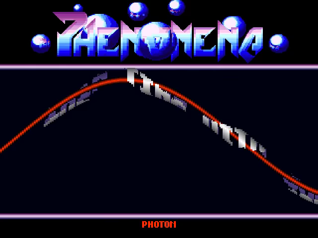
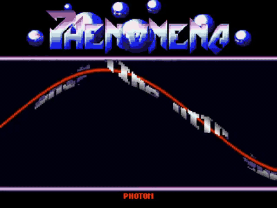

# phenomena-dna-scroll-intro
# Phenomena DNA Scroll Intro

Port Go/Ebitengine de l’intro Phenomena, disponible sur ordinateur et Android.

<!-- Project showcase -->
## Screenshots

[](docs/media/screenshot-1.png)

The Phenomena logo above a bitmap scroller following the animated red sine wave.

## Video

[](https://github.com/olivierh59500/phenomena-dna-scroll-intro/raw/refs/heads/main/docs/media/preview.mp4)

**[Watch or download the 24-second MP4 preview with sound](https://github.com/olivierh59500/phenomena-dna-scroll-intro/raw/refs/heads/main/docs/media/preview.mp4)**

This preview is captured from the Go production.

The animated image is silent; the MP4 includes the soundtrack.

<!-- End project showcase -->

## Ordinateur

```sh
go run ./cmd/phenomena
```

Les flèches haut/bas règlent le volume. Un clic lance la séquence de sortie.

## Vérifications

```sh
go test ./...
go test -race ./...
go vet ./...
```

## Android

La configuration validée utilise Java 17, Android SDK 36, NDK r28.2,
Gradle 8.11.1, Ebitengine 2.9.11 et une cible `arm64-v8a`.

Avec un appareil Android autorisé en USB :

```sh
./scripts/run-android.sh
```

Le script génère l’AAR Ebitengine, compile l’APK de débogage, l’installe puis
lance `com.olivierh.phenomenadna/.MainActivity`. Un toucher pendant la scène
principale lance la séquence de sortie, comme le clic sur ordinateur.

## Optional DCK version

The original implementation remains at its original paths. Run it with `go run ./cmd/phenomena`.

The construction-kit version is in [dck/](dck/README.md). Run `go run ./dck/cmd/phenomena` from this directory. Both versions share the original assets.
